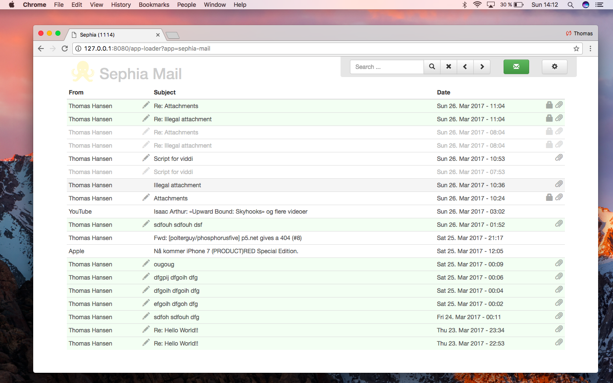

# Sephia Five

A blistering fast, secure, virus free, and PGP cryptography based alternative to GMail. Reclaim your 
privacy today!

See an introductory video about Sephia [here](https://www.youtube.com/watch?v=_hRZnQCCKyY), 
or [here](https://www.youtube.com/watch?v=lzRJGU2UrT0) for a deeper introduction to Sephia, demonstrating it in practice.

## Installation

First download [Phosphorus Five](https://github.com/polterguy/phosphorusfive), and follow the recipe below.

* Put the main _"/sephia-five/"_ folder inside of your _"/phosphorusfive/core/p5.webapp/system42/apps/"_ folder. Important; Make sure the Sephia Five folder is called exactly _"sephia-five"_.
* Create a MySQL database, and create a connection string in your web.config, and name it "sephia". Your web.config file can be found in your _"/phosphorusfive/core/p5.webapp/"_ folder. There should be an example connection string for connecting to a local MySQL database there.
* Install GnuPG (on Mac use GPG Keychain for instance)

Restart your web server process, configure Sephia, and enjoy.

Hint, you'll need to have either Xamarin, MonoDevelop, or Visual Studio installed locally, to test it on your
development machine - In addition to access to a MySQL instance, where you can create your database.

**Disclaimer;** _"No teddy bears was harmed during the creation of Sephia Five!"_
