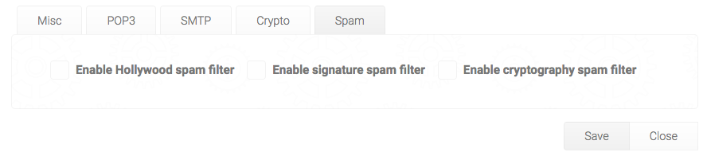

# Sephia Five - Military grade cryptography for the people

Sephia Five is an Open Source webmail system, that among other things features military grade PGP cryptography, so ridiculously easy to use, that we refer to its design principles as KISS - _Keep It Simple and Stupid_.

Security starts with simplicity. Unless something is simple, it can never be secure. Complexity in the user interface makes people do erronous things. Simplicity eliminates a lot of these pitfalls, and such becomes a guarantor of security. When you open up Sephia Five, you are by default only presented the choices, that are the actions you most likely want to do. Two buttons, period! Compare our UX to that of GMail or Outlook, and you will realise the value of _"less is more"_.


The squid button, will toggle more options for you, allowing you to search your emails, page back and forth, access your settings, etc - But by default, these choices are hidden, to create as little _"cognitive noise"_ for you as possible. Sephia Five is _"Zen software"_.

## Security is more than cryptography

Most intrusions and data leaks occurs due to human behavior. Kevin Mitnick often referred to himself as a social engineer, and not a hacker, since he would primarily take advantage of human weakness, instead of launching a direct attack on a computer system. Medio 2017, the Norwegian government had a huge data leak, which created a lot of problems to the Norwegian minister of fish Per Sandberg. The reason was that a fishing tycoon had sent an email to _"per.sandberg@gmail.com"_ instead of _"persandberg@gmail.com"_. The guy who owned this email address, informed Norwegian media, and the scandal was a fact. There were raised concerns about corruption, and the minister of fish had a very rought time. I don't think Sandberg particularly enjoyed having his private emails dissected on the front page of some of Norway's largest news papers.


In Sephia Five you will be thoroughly warned if you attempt to send an email to somebody who is not on your list of contacts, largely eliminating these types of problems.

## Virus elimination

Sephia Five can be configured to be 100% secure in regards to virus and malware, never allowing an attachment that could potentially contain malware to be downloaded to the client. By default unfortunately, some attachments such as PDF files, which actually are responsible for more than 50% of malware in email attachments, are notoriously popular in use. We have solved this by having two types of _"whitelists"_ for attachments. One list of 100% safe attachments, such as images and text files, which will be downloaded immediately. Another list that will warn the user when he or she tries to download a file, that could potentially contain malware.


You can easily configure yourself which files are legal, illegal, and suspect. But the default configuration, would probably be good enough for most installations.

## Privacy is more than avoiding data theft

99% of all emails that are composed with rich HTML, are ads and distractions, intended to steal your attention. Microsoft once conducted research in this area, and found that even the smallest distractions, would destroy 23 minutes of productive work. In Sephia Five, we have simply eliminated the ability to render HTML emails. Unless an email has an alternative plain text view, Sephia Five will simply not show it. This will reduce the amount of _"cognitive noise"_, and allow you to enjoy your privacy, and stay more focused within your zone.


Compare the above email to your latest email from YouTube, and you will understand what this implies for your privacy.

## Hollywood spam filter

In Hollywood there is a saying - _"Don't call us, we'll call you"_. In Sephia Five we have created a spam filter according to these ideas. If you wish, you can turn on the Hollywood spam filter, which means that you will never again have an email from a person whom you did not send an email to first.



You can create exceptions to the above rule, for explicitly chosen email adresses.

## Time slots for reading email

_"Innocent distractions"_ are one of our primary productivity thieves. Often these can be social emails, sent by coworkers or friends, intended to allow people to socialise and interact with each other. In Sephia Five we have solved this by allowing you to declare at which times during the day its users are allowed to check for email. If an employee or user attempts to check his email outside of these times, Sephia Five will simply not check for email, and not allow him to update his or her inbox.

This allows you and your employees to _"stay in the zone"_, and focus on the task at hand, without distractions. This can of course be configured on a per user and role basis, and filtered according to the user's role. This allows you to for instance have your sales staff be able to check their emails all the time, while your system developers can only check their emails 08:00, 12:00 and 15:00 for instance.

If a user tries to check his email outside of his allocated time slots, he will simply not receive them.

## PGP miltary grade cryptography KISS

When Edward Snowden fled to Russia, he was communicating with journalists using PGP cryptography. Bruce Schneier once said _"PGP cryptography is the closest you come to military grade cryptography in the public space"_. PGP is however unfortunately ridiculously complex to use for people who are not computer geniouses. In Sephia Five we have reduced the complexity of using PGP cryptography, to the point where it almost automagically happens.


In Sephia Five we will even _"babelize"_ the subject line, by encrypting the original subject, and inserting a randomly fetched subject. This _"babelized"_ subject will be automatically fetched from a news provider, such as the New York Times, Wall Street Journal, or any other website you wish to use as a _"babelizing service"_. For an adversary picking up on your conversation, the email will be perceived as an innocent discussion about some random news article - While it could actually be a conversation between the US President to his minister of defense, carrying nuclear rocket launch codes, without any adversary having as much as a single suspicion.

With Sephia Five you can also create PGP key pairs up to 8192 bit strength, implying that every single super computer on the planet, would need billions of years working together, to be able to decrypt as much as a single byte from the original email!


Look carefully at the above screenshot, and notice the smiley. A happy face implies that the email was sent encrypted, and that it was cryptographically signed, with a private PGP key, that you have verified belongs to the one who claims to own it.

If you print your PGP fingerprint on for instance your business cards, then anyone you meet, and hand out a business card to, can easily verify that an email conversation has been cryptographically secured between you two.

To cryptographically sign a public PGP key, upload it to a key server, using the features of the _"web of trust"_, has literally been reduced to a happy face, and a sad face. And whenever anyone sends you a cryptographicall signed email, Sephia Five will automatically fetch that key from a public PGP key server. All this will happen automatically, leaving you with only occassionally having to look through your contacts, and verifying their fingerprints.


Basically, as long as you receive a happy email, you can be 100% perfectly confident on that the communication have been cryptographically secured. If you receive a neutral face email, you can be almost certain, but not entirely of that the communication is secured. If you receive a sad face email, you might as well start communicating using postcards.

The above screenshot also illustrates a crucial point, which is that every time Sephia Five requires you to carefully think before you act - It will show you a red warning. This is in fact the only use of colors we have in Sephia Five by default, which further reduces _"cognitive noise"_.

## Compose your emails using Markdown

Although Sephia Five does not accept HTML emails, you can still apply formatting to your emails using Markdown. This allows you to easily create some simple formatting to your text, by writing your emails using Markdown.

In addition, Sephia Five also supports something we have invented ourselves, which we are particularly proud of, which we refer to as _"conversations"_. Conversations allows you to keep the context in your email replies, by having Sephia Five automatically deduct who said what, as you bounce an email conversation back and forth a couple of times.


Sephia Five will accept any Markdown, but still _"wash"_ all emails it displays for any potentially malicious HTML elements, such as script inclusions, etc.

## Extreme availablity without compromising security

Even though Sephia Five is first of all built to be secure, it is also extremely easy to use, and has extreme availability. If you wish, you can set it up on a web server, and access your emails from any device you own, regardless of where you are in this world. If you combine this with SSL, you can have the convenience of reading your email from anywhere you might be in the world, while still having bullet proof cryptography protecting your privacy.

**Disclaimer** - It is crucial that you setup your web server to only serve Sephia Five over SSL if you allow access to it over the general internet. Otherwise, all the security measures we have created for you, are pointless!

Since Sephia Five is loaded within an SSL context, this means that once you close your browser window, nothing stays cached in your client. So even if somebody physically steals your phone, tablet or computer - They will still not have access to your emails, which are safely stored on your server.

If you can secure your server, Sephia Five can secure your emails, such that the only way an adversary could gain access to your emails, would be to physically break into your office or home, and steal your server. Needless to say, but this trait of Sephia Five, significantly reduces your risk when communicating with clients, friends, and partners.

Not even the private PGP key is stored on any of the clients you use to read your emails. All your data, including your private PGP key, is safely secured on your own personal server, which you can secure in your home or office.

The database used to store your PGP key pairs is GnuPG, which the German government believed so strongly in, that they chose to sponsor the project with government money to help maintain. Every third party component used in Sephia Five, is what is recommended as best practices for securing your communication and data.

## Extreme usability

Sephia Five is carefully created to be as easy to use as possible. For instance, in Sephia, you can read multiple emails at the same time, and go back and forth between them, while replying to multiple emails, and composing several new emails at the same time.

This allows you to cross-reference content from multiple emails, empowering you in your communication, without having to juggle multiple browser windows. You can even perform a search for an email, open that email, perform another search, page back and forth several times, for then to open up another email - And the email you opened up originally will _"stick"_, and still be open.


These features of Sephia Five, gives you an enhanced user experience, allowing you to work the way you wish to work - And not the way some software vendor's limitations forces you to work.

## Bandwidth consumption

Sephia Five is ridiculously small in its bandwidth consumption. This implies that it will load faster over very slow internet connections, compared to other web mail clients. Below is a graph showing the difference in bandwidth consumption between GMail and Sephia Five.


For the record, less is more, and smaller is better.

## Add your own design

Although we ourselves are not particularly happy about _"color salads"_, it is very easy to apply your own design to Sephia Five. In fact, out of the box, Sephia Five comes with no less than 5 different themes, that you can easily customise according to your own needs. Below is an example of how the settings form will look like with the _"Sea Breeze"_ theme. Each user can in fact also choose his own theme, and such apply whatever design he or she feels are covering their needs.


To modify any of the existing themes, to create your own design, should be easy for a desent designer.

## Sephia Five is also a platform

Sephia Five is in fact more than _"just an app"_. There are several publicly available Active Events you can consume in your own application, to such consume Sephia Five as a _"module"_ from within your own applications.

This makes it easy for you to not only significantly extend Sephia Five, but to also consume it as a _"plugin"_ in your own applications, and easily interact with it, allowing you (or us) to create applications that seemlessly interact with Sephia, one way or another - Such as CRM applications for instance.

## Trust is irrelevant

We will never ask you to trust us. We could be tortured or coerced by an adversary to give up your data, at which point most would yield. However, even if somebody points a gun to our heads, we couldn't disclose any of your secrets - Not even if we wanted to.

With us, trust is a technical implementation feature, and an intrinsic part of our business model, implying that you'd never need to trust us, since you can easily verify that what we are saying is correct.

First of all, Sephia Five is open source, and does not contain as much as a single line of closed source code. All the way from the core of Linux, through MySQL as its database, to Sephia Five itself. Which means that what we say, can be verified by any technically savvy system developer, wanting to verify our claims. And even if you choose to purchase our professional user management module, you will get access to its code - Even though legally, it is not open source, since you are not allowed to distribute it.

This means that if there were to be created a backdoor in Sephia Five, due to us being coerced into creating one - It would simply be a matter of time before the general public got to know about it, and we would be lynched.

In addition, we will never host your data or Sephia Five installation. In fact, even if you begged us to, we would refuse. This means that even if an adversary where to physically break into our office, put a gun to our head, and force us to disclose your secrets, we would simply have to answer him; _"Shot us, it is simply not possible"_.

The reasons why, is because we do not offer hosting. We simply offer you the tools, to setup your own server park, giving you 100% control over your own data. And even if we were to help you setup your own server, we would demand of you that you change any server passwords and such, after we have finished setting it up. This allows you to host your email system, anywhere you would want to, without even having to trust us.

The director of Intel once famously said _"Only the paranoid will survive"_. We are survivors, are you ...?

According to Chinese tradition, him who _"hear no evil, and see no evil, cannot tell any evil"_. We are blind, deaf, and mute, and it is a part of our core vision and business model. Do you want to know a secret? Then ask someone else, we know none!

For the record, we obviously treat all of our clients with 100% confidentiality, which shows in the fact that you won't find any list of customers of ours, anywhere - Neither on our website, nor any other places, you will never find a _"happy customer testimonial"_. Sephia Five neither identifies itself anywhere in the data it transmits to other servers in any ways. So nobody would even know whether or not you're using Sephia Five, or some other email system.

Take a look at the screenshots I have supplied here please. Can you see something missing? There is not a single logo, brand name, or anything that identifies your email system in any ways. The first step towards breaking into a system, is to understand what system you are dealing with. Sephia Five will never even give an adversary any clues as to which system he is even facing. Not even if he bends over your shoulders, and looks at you while you are composing an email, he will understand what email system you are using.

## Getting started

If you wish to try out Sephia Five, you can follow the guide below.

1. [Download Phosphorus Five](https://github.com/polterguy/phosphorusfive/releases) 
2. [Download Sephia Five](https://github.com/polterguy/sephia-five/releases)
3. [Download Micro](https://github.com/polterguy/micro/releases)
4. [Download System42](https://github.com/polterguy/system42/releases)
5. Put the unzipped _"micro"_, _"sephia-five"_ and _"system42"_ folders into the _"p5.webapp"_ folder inside of your Phosphorus Five folder. Make sure you rename the _"system42-xx-yy"_ folder to be named **only** _"system42"_.
6. [Download MySQL](https://dev.mysql.com/downloads/) -You will probably want to download also the MySQL Workbench, in addition to the core database.
7. Create a database in MySQL, name it e.g. _"sephia"_.
8. Modify and uncomment the connection string in the _"web.config"_ file, inside of the Phosphorus Five folder called _"p5.webapp"_ to point to your MySQL database. It is important that the name of your connection string is _"sephia"_.
9. Make sure you have GnuPG installed on your system. On Mac OS, this can be accomplished by installing _"GPG Keychain"_.
10. Open up the _"p5.sln"_ file in either Visual Studio, Xamarin, or Mono Develop, and start your debugger.

When System42 have started, create a server salt, a root password, and open up _"Apps/CMS"_, and create a new _"lambda"_ page, by clicking the _"+"_. Click the _"Settings"_ button, and make sure you use the _"empty"_ template. Paste in the following code into the CodeMirror Hyperlambda code editor.

```
sys42.utilities.execute-lambda-file:@SEPHIA/launch.hl
```

Click _"View page"_ and enjoy your privacy.

### Using Sephia with your GMail address

Sephia Five's default configuration, points to GMail's POP3 servers and SMTP servers. This means that as you start up Sephia Five, and go through the setup process - The only thing you'll have to do to test it, is to supply your GMail username and password, and Sephia Five will immediately start using your GMail address.

You might have to make sure you enable POP3 access for your GMail account, but Sephia Five's setup process will guide you through these steps.


If you use Sephia Five in combination with your GMail address, all your email will still be perfectly encrypted and safe, and not even the employees of GMail can read your email. Not even the subjects of your emails.

### Using Sephia without a web server

Although Sephia Five is created for web servers, as a _"web mail client"_, you can still install it locally on e.g. something such as a Linux laptop, having Apache and MySQL running in the background, with mod_mono mappings to get Apache to serve your ASP.NET web application. If you do, you could simply create a shortcut on your desktop that points to _"localhost/xx"_, and Sephia would open up in your browser, running your local website. We are currently working on creating an automatic Debian based packet repository, that would significantly reduce the complexity of this setup process. However, for the time being, unfortunately you're on your own if you wish to create such a configuration.

When we have done this though, to install Sephia Five on either a Linux laptop, or a Linux web server (Debian based), would imply nothing else than simply add our repository to your packet manager, choose Sephia Five, and start the installation process.

### User management

Sephia Five is a multiuser system (obviously), and we provide a _"professional addon"_ to Sephia Five, which allows you to manage your users. This module is not technically _"open source"_, since we too need bread and butter. However, if you would want to create multiple users for your system, you could do this with the _"Apps/Executor"_ in System42, by typing in something like the following, and evaluating it.

```
p5.auth.users.create:some-username
  password:some-pa$$word
  role:super
```

Notice, if you evaluate the above code, while running your website in the XSP web server (development web server, included in e.g. Xamarin and Mono Develop) - Then your website will crash, and you will have to restart it, due to that the above code will create a new folder on disc for you, containing among other things a web.config file. This is only a problem when you are testing your Sephia Five installation on a development box though, and not a problem in a real live environment.

If you would want to have a more easy way to manage your users, we would be happy to talk to you about our professional user module. If so, feel free to toss our CTO an email at thomas@gaiasoul.com.

The user management module, also features a lot of additional features, such as the ability to _"lock out"_ users from Sephia Five, run some diagnostics, in addition to that it easily allows you to manage your existing users, within the comforts of a nice GUI, easily accessible for any _"root"_ account on your system. For a professional company, with multiple employees, this would provide a highly more convenient way of managing your users and your Sephia Five installation. We also provide professional support and help, in addition to installation help for companies and organisations who purchase our user management module.

Notice, even though our user module is not technically _"open source"_, you still gain access to its source code, allowing you to verify that there are no backdoors in it, or other implementation details, that could compromise your security. You are however not allowed to distribute it to other individuals, and/or companies/organisations.

## Technical implementation details

Sephia Five is built with the following core technologies.

1. Phosphorus Five and Hyperlambda, which is built on top of C# and .Net/Mono
2. MySQL
3. Bouncy Castle
4. MimeKit and MailKit
5. Gnu Privacy Guard (GnuPG)

It works perfectly fine on both Windows, Linux, and Mac OS. Although, for a serious installation, in a live environment, we recommend installing it on a Linux server.

## Getting professional help

The creators of Sephia Five, are providing professional services, and helping companies and organisations to setup Sephia Five. If you wish to speak with us about our commercial offerings, or need help to initially secure your email server, you can contact our CTO at thomas@gaiasoul.com. We only ask two things of you.

1. Change all your server passwords after we have initially setup your server
2. [Read this](https://gaiasoul.com/2017/08/05/how-to-become-a-customer-of-us/), and realise we mean business!

## Sephia Five is not (yet) stable

Notice, for the record. Sephia Five is still in _"BETA"_ mode. This means that it should not be used in production (yet). Still, you can easily set it up for performing tests, and we are ready to start talking to professional companies and organisations, who wants to hear about our commercial offerings.

Some missing features though, which we have on our TODO list, which is still not yet implemented - Can be found below.

1. Finish up the user module.
2. Implement user _"lock out"_ if more than x emails are being read in a day, which would prevent an adversary from stealing a client that is already logged in, and rapidly reading every single email in a user's inbox, before you notice that your client has been stolen, and can change your password.
3. Implement user _"lock out"_ if the wrong password has been typed more than x times, to prevent brute force password attacks.
4. Allow users to change their passwords from within Sephia Five.
5. Create a Debian repository, allowing for a single click installation process, on Debian based servers and clients.

Some of the above features are crucial for your privacy and security. Therefor, we do not recommend you installing Sephia Five in a real live production environment just yet. If you'd like to get notified of when Sephia Five becomes stable, and ready for production environments, feel free to for instance subscribe to my [blog](https://gaiasoul.com).

## Disclaimer

Although we have done everything to ensure your privacy and security, no absolute guarantees can ever be given - And anyone claiming to give you such, are lying. Bugs are real, and accidents do occur. We have done everything within our powers to eliminate as many security risks as possible, and we have done our best to keep your privacy secured - But we cannot guarantee you 100% security. None can in fact.

For instance, a lot of variables are out of our hands, such as the technical skillset of your sys-admins, and the loyalty of your friends/coworkers. These are variables which we have tried our best to control, and such reduce the threat-level to a minimum. However, 100% perfection can never be achieved.

If you would like to reduce the threat-level further, it is probably wise to talk to us, and/or hire us, to help you getting started. We can provide best practices, perform the initial installation, and training of both your employees and sys admins - To such further reduce your exposure, and keep you even more secure. If you would like to hear more about our commercial offerings, feel free to toss our CTO an email at thomas@gaiasoul.com. And realise, [this is what we do](https://gaiasoul.com/2017/08/05/how-to-become-a-customer-of-us/).

Kind Regards,

Thomas Hansen - CTO at T.H. Rose Home Cloud, Ltd


