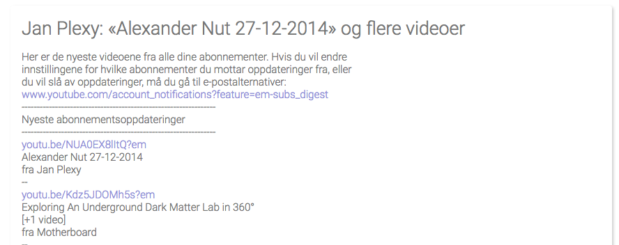

# Sephia Five - Military grade PGP cryptography for everyone

Sephia Five is an Open Source webmail system, that among other things features military grade PGP cryptography, so ridiculously easy to use, that we refer to its design principles as KISS - _Keep It Simple and Stupid_. Security starts with simplicity. Unless something is simple, it can never be secure. Complexity in the user interface makes people do erronous things. Simplicity eliminates a lot of these pitfalls, and such becomes a guarantor of security.

## Security is more than cryptography

Most intrusions and data leaks occurs due to human behavior. Kevin Mitnick often referred to himself as a social engineer, and not a hacker, since he would primarily take advantage of human weakness, instead of launching a direct attack on a computer system. Medio 2017, the Norwegian government had a huge data leak, which created a lot of problems to the Norwegian minister of fish Per Sandberg. The reason was that a fishing tycoon had sent an email to what he thought was Per Sandberg's private email, but actually lead to a completely different guy.

## Virus elimination

Sephia Five can be configured to be 100% secure in regards to virus and malware, never allowing an attachment that could potentially contain malware to be downloaded to the client. By default unfortunately, some attachments such as PDF files, which actually are responsible for more than 50% of malware in email attachments, are notoriously popular in use. We have solved this by having two types of _"whitelists"_ for attachments. One list of 100% safe attachments, such as images and text files, which will be downloaded immediately. Another list that will warn the user when he or she tries to download a file, that could potentially contain malware.

You can easily configure yourself which files are legal, illegal, and suspect.

## Privacy is more than avoiding data theft

99% of all emails that are composed with rich HTML, are ads and distractions, intended to steal your attention. Microsoft once conducted research in this area, and found that even the smallest distractions, would destroy 23 minutes of productive work. In Sephia Five, we have simply eliminated the ability to render HTML emails. Unless an email has an alternative plain text view, Sephia Five will simply not show it. This will reduce the amount of _"cognitive noise"_, and allow you to enjoy your privacy, and stay more focused within your zone.

Compare the above email to your latest email from YouTube, and you will understand what this implies for your privacy. Notice, you can still apply some basic formatting to emails you send and receive, since Sephia Five supports composing emails using Markdown.

## Hollywood spam filter

In Hollywood there is a saying - _"Don't call us, we'll call you"_. In Sephia Five we have created a spam filter according to these ideas. If you wish, you can turn on the Hollywood spam filter, which means that you will never again have an email from a person whom you did not send an email to first.

You can create exceptions to the above rule, for explicitly chosen email adresses.

## Time slots for reading email

_"Innocent distractions"_ are one of our primary productivity thieves. Often these can be social emails, sent by coworkers or friends, intended to allow people to socialise and interact with each other. In Sephia Five we have solved this by allowing you to declare at which times during the day its users are allowed to check for email. If an employee or user attempts to check his email outside of these times, Sephia Five will simply not check for email, and not allow him to update his or her inbox.

This allows you and your employees to _"stay in the zone"_, and focus on the task at hand, without distractions. This can of course be configured on a per user and role basis, and filtered according to the user's role. This allows you to for instance have your sales staff be able to check their emails all the time, while your system developers can only check their emails 08:00, 12:00 and 15:00 for instance.

If a user tries to check his email outside of his allocated time slots, he will simply not receive them.

## PGP miltary grade cryptography KISS

When Edward Snowden fled to Russia, he was communicating with journalists using PGP cryptography. Bruce Schneier once said _"PGP cryptography is the closest you come to military grade cryptography in the public space"_. PGP is however unfortunately ridiculously complex to use for people who are not computer geniouses. In Sephia Five we have reduced the complexity of using PGP cryptography, to the point where it almost automagically happens.

### Encrypting the subjects of your emails

In Sephia Five we will even _"babelize"_ the subject line, by encrypting the original subject, and inserting a randomly fetched subject. This _"babelized"_ subject will be automatically fetched from a news provider, such as the New York Times, Wall Street Journal, or any other website you wish to use as a _"babelizing service"_. For an adversary picking up on your conversation, the email will be perceived as an innocent discussion about some random news article - While it could actually be a conversation between the US President to his minister of defense, carrying nuclear rocket launch codes, without any adversary having as much as a single suspicion.

With Sephia Five you can also create PGP key pairs up to 8192 bit strength, implying that every single super computer on the planet, would need billions of years working together, to be able to decrypt as much as a single byte from the original email.

Look carefully at the above screenshot, and notice the smiley. A happy face implies that the email was sent encrypted, and that it was cryptographically signed, with a private PGP key, that you have verified belongs to the one who claims to own it.

If you print your PGP fingerprint on for instance your business cards, then anyone you meet, and hand out a business card to, can easily verify that an email conversation has been cryptographically secured between you two.

Basically, as long as you receive a happy email, you can be 100% perfectly confident on that the communication have been cryptographically secured. If you receive a neutral face email, you can be almost certain, but not entirely sure of that the communication is secured. If you receive a sad face email, the email was not sent encrypted, but rather in plain text.

## Compose your emails using Markdown

Although Sephia Five does not accept HTML emails, you can still apply formatting to your emails using Markdown. This allows you to easily create some simple formatting to your text, by writing your emails using Markdown.

In addition, Sephia Five also supports something we have invented ourselves, which we are particularly proud of, which we refer to as _"conversations"_. Conversations allows you to keep the context in your email replies, by having Sephia Five automatically deduct who said what, as you bounce an email conversation back and forth a couple of times.

Sephia Five will accept any Markdown, but still _"wash"_ all emails it displays for any potentially malicious HTML elements, such as script inclusions, etc.

## Extreme availablity without compromising security

Even though Sephia Five is first of all built to be secure, it is also extremely easy to use, and has extreme availability. If you wish, you can set it up on a web server, and access your emails from any device you own, regardless of where you are in this world. If you combine this with SSL, you can have the convenience of reading your email from anywhere you might be in the world, while still having bullet proof cryptography protecting your privacy.

**Disclaimer** - It is crucial that you setup your web server to only serve Sephia Five over SSL if you allow access to it over the general internet. Otherwise, all the security measures we have created for you, are pointless!

If you can secure your server, Sephia Five can secure your emails, such that the only way an adversary could gain access to your emails, would be to physically break into your office or home, and steal your server. Needless to say, but this trait of Sephia Five, significantly reduces your risk when communicating with clients, friends, and partners.

## Extreme usability

Sephia Five is carefully created to be as easy to use as possible. For instance, in Sephia, you can read multiple emails at the same time, and go back and forth between them, while replying to multiple emails, and composing several new emails at the same time.

This allows you to cross-reference content from multiple emails, empowering you in your communication, without having to juggle multiple browser windows. You can even perform a search for an email, open that email, perform another search, page back and forth several times, for then to open up another email - And the email you opened up originally will _"stick"_, and still be open.

These features of Sephia Five, gives you an enhanced user experience, allowing you to work the way you wish to work - And not the way some software vendor's limitations forces you to work.

## Bandwidth consumption

Sephia Five is ridiculously small in its bandwidth consumption. This implies that it will load faster over very slow internet connections, compared to other web mail clients. Below is a graph showing the difference in bandwidth consumption between GMail and Sephia Five.

For the record, less is more, and smaller is better. This implies that Sephia Five will load 25 times faster than GMail on a slow internet connection.

## Add your own design

Although we ourselves are not particularly happy about _"color salads"_, it is very easy to apply your own design to Sephia Five. In fact, out of the box, Sephia Five comes with no less than 5 different themes, that you can easily customise according to your own needs. Below is an example of how the settings form will look like with the _"Sea Breeze"_ theme. Each user can in fact also choose his own theme, and such apply whatever design he or she feels are covering their needs.

To modify any of the existing themes, to create your own design, should be easy for a desent designer.

## Getting started

The easiest way to install Sephia Five is through the _"Bazar"_ of [Phosphorus Five](https://github.com/polterguy/phosphorusfive). Follow the installation
instructions over at the Phosphorus Five repository, visit the _"Bazar"_, choose Sephia Five, and enjoy your privacy!

### Using Sephia with your GMail address

Sephia Five's default configuration, points to GMail's POP3 servers and SMTP servers. This means that as you start up Sephia Five, and go through the setup process - The only thing you'll have to do to test it, is to supply your GMail username and password, and Sephia Five will immediately start using your GMail address.

You might have to make sure you enable POP3 access for your GMail account, but Sephia Five's setup process will guide you through these steps.

If you use Sephia Five in combination with your GMail address, all your email will still be perfectly encrypted and safe, and not even the employees of GMail can read your email. Not even the subjects of your emails.

## License

Sephia Five is licensed under the terms of the GNU GPL version 3. See the attached LICENSE file for details.

There also exists [commercial sub-licensing options](https://gaiasoul.com/license/) for those wanting to sub-license Sephia Five. You are also welcome to send me an email at thomas@gaiasoul.com - If you'd like to speak to me about commercial venues, or other issues.
