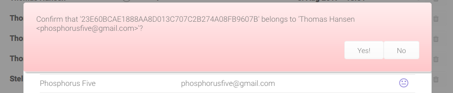

# Sephia Five - Ridiculously simple cryptography

Sephia Five is a web server based email system, that among other things features military grade PGP cryptography, so ridiculously easy to use, that we refer to its design principles as KISS - _Keep It Simple and Stupid_.

Security starts with simplicity. Unless something is simple to understand, it can never be secure. Complexity in the user interface makes people do erronous things. Simplicity eliminates a lot of these pitfalls, and such becomes a guarantor of security. When you open up Sephia Five, you are by default only presented the choices, that are the actions you most likely want to do. Two buttons, period! Compare our UX to that of GMail or Outlook, and you will realise the value of _"less is more"_.

The squid button, will toggle more options for you, allowing you to search your emails, page back and forth, access your settings, etc - But by default, this button is hidden, to create as little _"cognitive noise"_ for you as possible.

## Security is more than cryptography

Most intrusions and data leaks occurs due to human behavior. Kevin Mitnick often referred to himself as a social engineer, and not a hacker, since he would primarily take advantage of human weakness, instead of launching a direct attack on a computer system. Medio 2017, the Norwegian government had a huge data leak, which created a lot of problems to the Norwegian minister of fish Per Sandberg. The reason was that a fishing tycoon had sent an email to _"per.sandberg@gmail.com"_ instead of _"persandberg@gmail.com"_. The guy who owned this email address, informed Norwegian media, and the scandal was a fact. There were raised concerns about corruption, and the minister of fish had a very rought time. I don't think poor Sandberg particularly enjoyed having his private emails dissected on the front page of some of Norway's largest news papers.

In Sephia Five you will be thoroughly warned if you attempt to send an email to somebody who is not on your list of contacts, largely eliminating these types of problems.

## Virus elimination

Sephia Five can be configured to be 100% secure in regards to virus and malware, never allowing an attachment that could potentially contain malware to be downloaded to the client. By default unfortunately, some attachments such as PDF files, which actually are responsible for more than 50% of malware in email attachments, are notoriously popular in use. We have solved this by having two types of _"whitelists"_ for attachments. One list of 100% safe attachments, such as images and text files, which will be downloaded immediately. Another list that will warn the user when he or she tries to download a file, that could potentially contain malware.

## Privacy is more than avoiding data theft

99% of all emails that are composed with rich HTML, are ads and distractions, intended to steal your attention. Microsoft once conducted research in this area, and found that even the smallest distractions, would often destroy 23 minutes of productive work. In Sephia Five, we have simply eliminated the ability to render HTML emails. Unless an email has an alternative plain text view, Sephia Five will simply not show it. This will reduce the amount of _"cognitive noise"_, and allow you to enjoy your privacy, and stay focused within your zone.

Compare the above email to your latest email from YouTube, and you will understand what this implies for your privacy.

## Hollywood spam filter

In Hollywood there is a saying - _"Don't call us, we'll call you"_. In Sephia Five we have created a spam filter according to these ideas. If you wish, you can turn on the Hollywood spam filter, which means that you will never again have an email from a person whom you did not send an email to first.

Notice, you can still explicitly mark a sender to be allowed to send you emails. If you do, this would create exceptions to the Hollywood filter, allowing you to receive emails from some few people, whom you have not sent an email to first.

## Time slots for reading email

_"Innocent distractions"_ are one of our primary productivity thieves. Often these can be social emails, sent by coworkers or friends, intended to allow people to socialise and interact with each other. In Sephia Five we have solved this by allowing you to declare at which times during the day its users are allowed to check for email. If an employee or user attempts to check his email outside of these times, Sephia Five will simply not check for email, and not allow him to update his or her inbox.

This allows you and your employees to _"stay in the zone"_, and focus on the task at hand, without distractions. This can of course be configured on a per user and role basis, and filtered according to the user's role. This allows you to for instance have your sales staff be able to check their emails all the time, while your system developers can only check their emails 08:00, 12:00 and 15:00 for instance.

## PGP miltary grade cryptography KISS

When Edward Snowden fled to Russia, he was communicating with journalists using PGP cryptography. Bruce Schneier once said _"PGP cryptography is the closest you come to military grade cryptography in the public space"_. PGP is however unfortunately ridiculously complex to use for people who are not computer geniouses. In Sephia Five we have reduced the complexity of using PGP cryptography, to the point where it almost automagically happens.

In Sephia Five we will even _"babelize"_ the subject line, by encrypting the original subject, and inserting a randomly fetched subject. This _"babelized"_ subject will be automatically fetched from a news provider, such as the New York Times, Wall Street Journal, or any other website you wish to use as a _"babelizing service"_. For an adversary picking up on your conversation, the email will be perceived as an innocent discussion about some random news article - While it could actually be a conversation between the US President to his minister of defense, carrying nuclear rocket launch codes, without any adversary having as much as a single suspicion.

With Sephia Five you can also create PGP key pairs up to 8192 bit strength, implying that every single super computer on the planet, would need billions of years working together, to be able to decrypt as much as a single byte from the original email!

Look carefully at the above screenshot, and notice the smiley. A happy face implies that the email was sent encrypted, and that it was cryptographically signed, with a private PGP key, that you have verified belongs to the one who claims to own it.

If you print your PGP fingerprint on for instance your business cards, then anyone you meet, and hand out a business card to, can easily verify that an email conversation has been cryptographically secured between you two.

To cryptographically sign a public PGP key, upload it to a key server, using the features of the _"web of trust"_, has literally been reduced to a happy face, and a sad face. And whenever anyone sends you a cryptographicall signed email, Sephia Five will automatically fetch that key from a public PGP key server. All this will happen automatically, leaving you with only occassionally having to look through your contacts, and verifying their fingerprints.

Basically, as long as you receive a happy email, you can be 100% perfectly confident on that the communication have been cryptographically secured. If you receive a neutral face email, you can be almost certain, but not entirely of that the communication is secured. If you receive a sad face email, you might as well start communicating using postcards.

## Compose your emails using Markdown

Although Sephia Five does not accept HTML emails, you can still apply formatting to your emails using Markdown. This allows you to easily create some simple formatting to your text, by writing your emails using Markdown.

In addition, Sephia Five also supports something we have invented ourselves, which we are particularly proud of, which we refer to as _"conversations"_. Conversations allows you to keep the context in your email replies, by having Sephia Five automatically deduct who said what, as you bounce an email conversation back and forth a couple of times.

## Do not trust us!

Even if somebody points a gun to our heads, we couldn't disclose any of your secrets. Most security vendors starts out their sales pitch with the words _"trust us, we know what we're doing"_. I betcha Judas told Jesus the same words. With us however, trust is a technical implementation feature, and an intrinsic part of our business model, implying that you'd never even have to trust us, since you could yourself prove that what we are saying is accurate.

First of all, Sephia Five is open source, and does not contain as much as a single closed source component. All the way from the core of Linux to MySQL as its database, to Sephia Five itself. Which means that what we say, can be verified by any technically savvy system developer, wanting to verify our claims.

In addition, we will never host your data or Sephia Five installation. In fact, even if you begged us to, we would refuse! This means that even if an adversary where to physically break into our office, put a gun to our head, and force us to disclose your secrets, we would simply have to answer him; _"Shot us, we do not have the ability to do what you are coercing us into doing, it is simply impossible"_.

The reasons why, is because contrary to many other email providers, we do not offer hosting. We simply offer you the tools, to setup your own server park, giving you 100% control over your own data.

The director of Intel once famously said _"Only the paranoid will survive"_. We are survivors, are you ...?

## Getting started

If you wish to try out Sephia Five, you can download it from [this link](https://github.com/polterguy/sephia-five/releases). For a simple test, you use it in combination with Visual Studio, Xamarin or Mono Develop. In addition, you will need to have MySQL installed.

1. [Download Phosphorus Five](https://github.com/polterguy/phosphorusfive/releases) 
2. [Download Sephia Five](https://github.com/polterguy/sephia-five/releases)
3. [Download Micro](https://github.com/polterguy/micro/releases)
4. [Download System42](https://github.com/polterguy/system42/releases)
5. Put the unzipped _"micro"_, _"sephia-five"_ and _"system42"_ folders into the _"p5.webapp"_ folder inside of your Phosphorus Five folder. Make sure you rename the _"system42-xx-yy"_ folder to be named **only** _"system42"_.
6. [Download MySQL](https://dev.mysql.com/downloads/) -You will probably want to download also the MySQL Workbench, in addition to the core database.
7. Create a database in MySQL, name it e.g. _"sephia"_.
8. Modify the connection string in the _"web.config"_ file, inside of the Phosphorus Five folder called _"p5.webapp"_ to point to your MySQL database.
9. Open up the _"p5.sln"_ file in either Visual Studio, Xamarin or Mono Develop.
10. Enjoy your privacy!

## Getting professional help

The creators of Sephia Five, which is T.H. Rose Home Cloud, Ltd, are providing professional services, and helping companies and organisations to setup Sephia Five. If you wish to speak with us about our commercial offerings, or need help to initially secure your email server, you can contact our CTO at thomas@gaiasoul.com. We only ask two things of you.

1. Change all your server passwords after we have initially setup your server
2. [Read this](https://gaiasoul.com/2017/08/05/how-to-become-a-customer-of-us/), and realise we mean business!

Kind Regards,

Thomas Hansen

